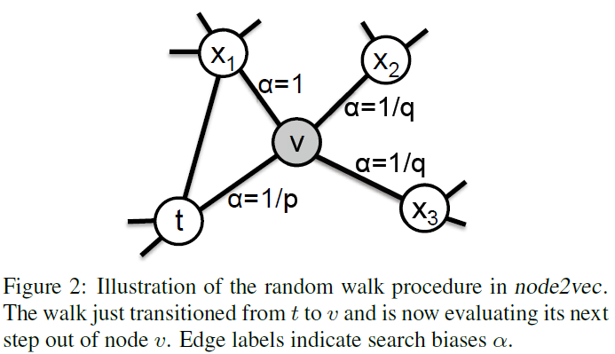

关于Node2Vec论文的理解

[Node2Vec]: https://arxiv.org/abs/1607.00653	"node2vec: Scalable Feature Learning for Networks"

主体框架

将复杂网络中的特征学习问题看做一个极大似然的优化问题。

给出复杂网络$G=(V,E)$（无需考虑是否有向有权的问题），寻找一个函数：$f:V\rightarrow \mathbb{R}^d$. 这个映射函数将节点信息映射为特征表征的$d$维向量。换个角度来说：$f$是一个维度为$|V|\times d$的矩阵。对于每一个节点$u$，我们定义$N_S(u)\subset V$为网络中节点$u$通过$S$这种采样方式得到的一个网络邻域 (network neighborhood). 

Node2Vec是基于Word2Vec框架搭建起来的，原文中将Skip-gram模型扩展到复杂网络中。作者构建起一个目标优化函数，这个目标函数希望在给定基于$f$的节点$u$的特征表征下，最大化观察到节点网络邻域$N_S(u)$的对数概率。

$$ \max_{f} \sum_{u \in V} \log Pr(N_S(u)|f(u)) $$

为了更好的处理此优化问题，我们给出两个标准假设：

1. 条件独立：$$ Pr(N_S(u)|f(u)) = \prod_{n_i \in N_S(u)} Pr(n_i|f(u))$$

2. 特征空间具有对称性：在特征空间中，源节点与邻节点之间存在对称效应。

   $$Pr(n_i|f(u)) = \dfrac{\exp(f(n_i)\cdot f(u))}{\sum_{v\in V} \exp (f(v) \cdot f(u))}$$

基于上述的两个假设，我们可以将目标函数改写为：

$$\max_f \quad \sum_{u \in V}\left[ -\log Z_u + \sum_{n_i \in N_S(u)} f(n_i) \cdot f(u) \right]$$

其中$Z_u = \sum_{v\in V} \exp(f(u)\cdot f(v))$.

融合BFS以及DFS（回头补充DFS和BFS的各自的优缺点）

考虑一种将BFS和DFS融合起来的随机游走的算法。给定一个节点$u$，我们去考虑一种固定长度$l$的随机游走。$c_i$表示在一个walk中的第$i$个节点（$c_0 = u$），$c_i$根据以下的分布生成：

$$P(c_i=x|c_{i-1}=v)=\begin{cases} \frac{\pi_{vx}}{Z} \quad \text{if }(v,x)\in E \\  0 \quad \text{otherwise}\end{cases}$$

其中$\pi_{vx}$表示的是在节点$v$和$x$之间的非规范化转移概率，同时$Z$表示的是归一化常数。

最简单的设置转移概率的方式就是$\pi_{vx}=w_{vx}$. （无权图就设置为$w_{vx}=1$）然而，这种方式并不允许我们考虑网络结构，以及我们的搜索过程探索不同类型的网络邻居。

定义一种二阶的随机游走方式（2nd order random walk），这个随机游走的方式由两个参数控制$p$和$q$.  假设现在一个random walk在边$(t,v)$上，同时现在停在了$v$点，那么下一步$(v,x)$的概率$\pi_{vx}$我们定义为$\pi_{vx}=\alpha_{pq}(t,x) \cdot w_{vx}$，其中：

$$\alpha_{pq}(t,x)=\begin{cases} \frac{1}{p} \quad \text{if }d_{tx}=0 \\ 1 \quad \text{if }d_{tx}=1 \\ \frac{1}{q} \quad \text{if }d_{tx}=2 \end{cases}$$

其中$d_{tx}$表示的是$t$到$x$点的最短路径。根据图2我们可以发现，$d_{tx}$一定属于${0,1,2}$其中的一个值，因此用两个参数来确定转移的概率是十分恰当的。

直觉上的理解：这两个参数控制的是这个walk从起始点$u$探索和离开其邻域的速度。